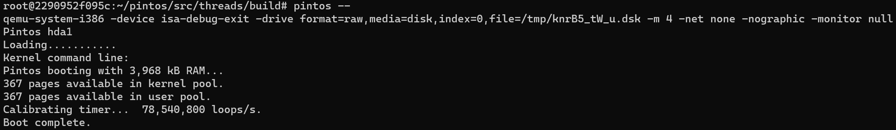
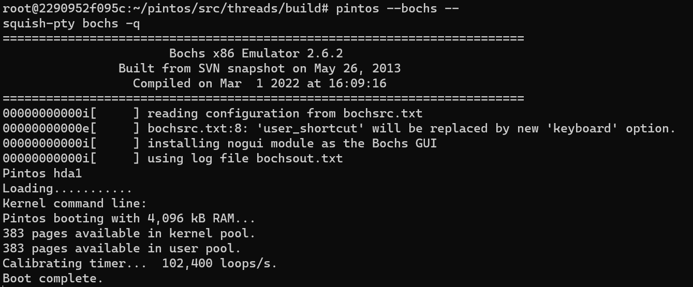
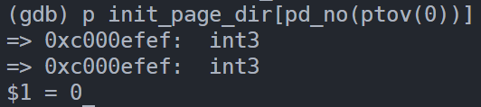
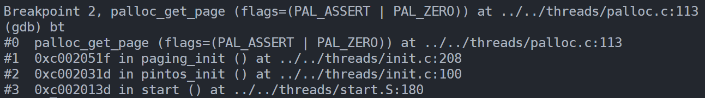
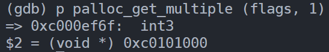
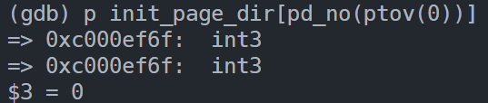
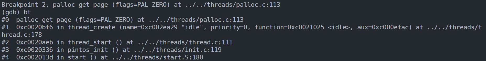
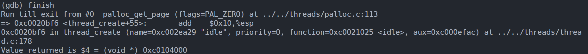
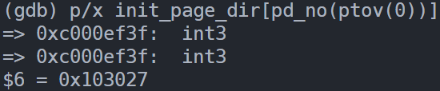
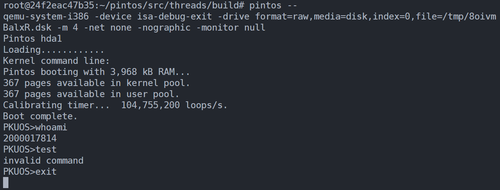

# Project 0: Getting Real

## Preliminaries

>Fill in your name and email address.

Chuyue Tang <2000017814@stu.pku.edu.cn>

>If you have any preliminary comments on your submission, notes for the TAs, please give them here.

>Please cite any offline or online sources you consulted while preparing your submission, other than the Pintos documentation, course text, lecture notes, and course staff.

https://en.wikipedia.org/wiki/BIOS_interrupt_call

https://en.wikipedia.org/wiki/Master_boot_record

https://stackoverflow.com/questions/9671820/print-variables-in-hexadecimal-or-decimal-format

https://stackoverflow.com/questions/58493511/how-can-i-use-printf-b-to-make-my-console-output-look-like-typewriter

https://www.oreilly.com/library/view/c-in-a/0596006977/re127.html

## Booting Pintos

>A1: Put the screenshot of Pintos running example here.

## Debugging

#### QUESTIONS: BIOS 

>B1: What is the first instruction that gets executed?

`ljmp   $0x3630,$0xf000e05b`

>B2: At which physical address is this instruction located?

`0xffff0`

#### QUESTIONS: BOOTLOADER

>B3: How does the bootloader read disk sectors? In particular, what BIOS interrupt is used?

The interrupt number is `int $0x13`, which refers to *Low Level Disk Services*. And the function number is specified in the AH register as `mov $0x42, %ah`, which refers to *Extended Read Sectors from Drive*. 

Also, it takes a drive number in `%dl` and a sector number in `%ebx`, and reads it into memory buffer at `%es:0000`.

>B4: How does the bootloader decides whether it successfully finds the Pintos kernel?

1. First, it checks whether it successfully reads the sector by register CF, which is set on error and clear if no error after the BIOS interrupt `int $0x13`;
2. If it successfully reads a sector, it then checks for MBR signature. The last 2 bytes of the 512-byte sector should match the boot signature: `cmpw $0xaa55, %es:510`; 
3. Then, it checks whether the first partition entry is inactive: `cmpl $0, %es:(%si)`. Here `%si` stores `446 (0x01BE)`, which is the offset of the first partition entry;
4. Later, it checks the partition type: `cmpb $0x20, %es:4(%si)`;
5. Last, it checks whether this drive is bootable: `cmpb $0x80, %es:(%si)`. If equal, it starts to load Pintos kernel.

>B5: What happens when the bootloader could not find the Pintos kernel?

1. It checks the next partition entry by increasing the offset stored at `%si` at most 4 times;
2. If none of the four is a bootable Pintos partition, it goes to the next drive and repeats checking partitions until error code is set in register CF;
3. Then it jumps to `no_such_drive`. It prints 'Not found' and uses BIOS interrupt `int $0x18` as a signal that it failed to complete its task.

>B6: At what point and how exactly does the bootloader transfer control to the Pintos kernel?

1. In subroutine `load_kernel`, it uses a loop to do `read_sector` for 1024 times, which is exactly 512 KB;
2. After loading the kernel from the drive, it reads the entry point address from the ELF header of `kernel.o` and jumps to the "start" (`0xc0020058` in our case). 

#### QUESTIONS: KERNEL

>B7: At the entry of pintos_init(), what is the value of expression `init_page_dir[pd_no(ptov(0))]` in hexadecimal format?

`0x0`

>B8: When `palloc_get_page()` is called for the first time,

>> B8.1 what does the call stack look like?
>> 

>> B8.2 what is the return value in hexadecimal format?
>> 

>> B8.3 what is the value of expression `init_page_dir[pd_no(ptov(0))]` in hexadecimal format?
>> `0x0`
>> 

>B9: When palloc_get_page() is called for the third time,

>> B9.1 what does the call stack look like?
>> 

>> B9.2 what is the return value in hexadecimal format?
>> 

>> B9.3 what is the value of expression `init_page_dir[pd_no(ptov(0))]` in hexadecimal format?
>> `0x103027`
>> 

## Kernel Monitor

>C1: Put the screenshot of your kernel monitor running example here. (It should show how your kernel shell respond to `whoami`, `exit`, and `other input`.)

>C2: Explain how you read and write to the console for the kernel monitor.

Read: `input_getc ()` defined in `devices/input.c`.

Write: `putchar ()` defined in `lib/kernel/console.c` and `printf ()` defined in `lib/stdio.c`.